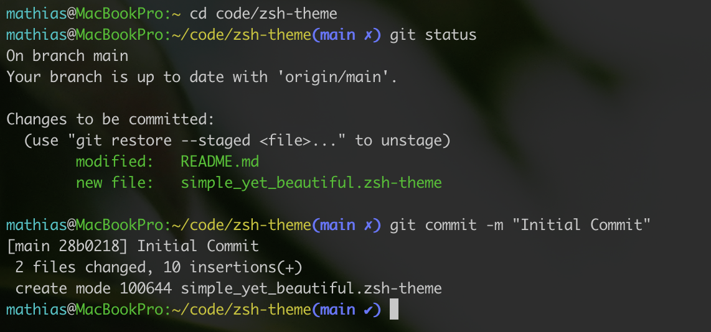

# simple but beautiful zsh-theme

My custom zsh theme.

It's simple but beautiful (yeah yeah that lies in the eye of the beholder, I know).

Check it out:

## Installation

1. `git clone git@github.com:mathiasmoeller/zsh-theme.git`
2. `cp zsh-theme/simple_yet_beautiful.zsh-theme ~/.oh-my-zsh/themes`
3. `echo 'ZSH_THEME=simple_yet_beautiful' >> ~/.zshrc`
4. `source ~/.zshrc`
